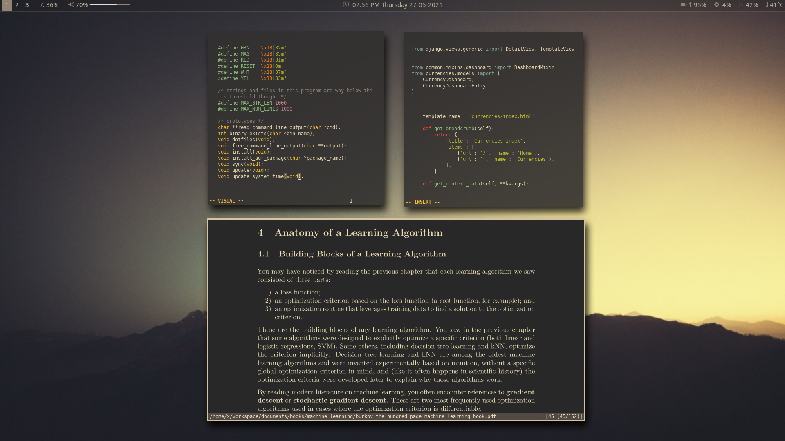

# Dotfiles



## Requirements

This readme does not teach you how to setup Arch linux itself.
To do so, you can either follow the
[arch wiki](https://wiki.archlinux.org/index.php/Installation_guide)
(which I recommend to at least try once in your life), or alternatively use
one installer like [Anarchy](https://www.anarchylinux.org/)

It's paramount that you have nothing apart from internet connection and `git`
installed in your environment. I.e, no windows/desktop manager
or anything of the kind as it can cause conflicts in the installation.

## Getting started

1) Once you get into arch terminal, clone this repo:
```shell
$ git clone https://github.com/marcelodufe/dotfiles.git
```
2) And execute the `install.sh` file:
```shell
$ ./install.sh
```
3) After the installation is completed reboot your system.
4) You can get into the i3 session by running `startx` in the terminal.

## This setup uses:
1) Arch linux
2) i3-gaps windows manager
3) neovim
4) polybar
5) gruv-box theming (via pywal)
6) rofi
